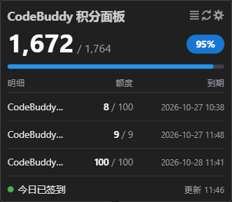

# CodeBuddy Quota

[English](README.en.md) | [简体中文](README.md)

在状态栏显示 CodeBuddy 积分额度，鼠标悬停查看积分面板浮窗

## 安装

在当前编辑器的扩展市场搜索 **CodeBuddy Quota**

也可从 [Releases](https://github.com/GhostCmdr/codebuddy-quota/releases/latest) 取 `.vsix` 自行安装。

## 前提

1. 在 VS Code或当前使用的vs系IDE里安装 Tencent Cloud CodeBuddy（`tencent-cloud.coding-copilot`）并登录
2. 本扩展从**当前所用编辑器**读取该扩展保存的登录态，无需手动复制 Cookie或Token

- 若自动读取失败，可在设置项 `codebuddyquota.manualToken` 填一次 accessToken 兜底（手动输入accessToken作为第一优先，重复输入则覆盖之前Token）
- 如需弃用手动输入，请执行命令 CodeBuddy Quota: 清除保管箱里的手动 Token

## 功能

- 状态栏实时显示剩余积分，点击立即刷新
- 悬停积分浮窗：剩余总量与占比 + 积分包明细，适配浅色主题
- 每日签到、喵喵旅行
- 定时自动刷新

## 设置

| 设置 | 默认 | 说明 |
|---|---|---|
| `codebuddyquota.refreshInterval` | 30 | 自动刷新间隔（分钟），0 关闭 |
| `codebuddyquota.autoCheckin` | true | 自动每日签到 |
| `codebuddyquota.buddyTravel` | true | 自动喵喵旅行领积分 |
| `codebuddyquota.detailRows` | 3 | 积分包显示数量，按到期升序，1~6 |
| `codebuddyquota.manualToken` | 空 | 手动 accessToken，填一次即收进加密保管箱 |

## 命令

| 命令 | 作用 |
|---|---|
| `CodeBuddy Quota: 刷新积分` | 立即取一次 |
| `CodeBuddy Quota: 立即签到` | 手动补签今天的签到 |
| `CodeBuddy Quota: 清除保管箱里的手动 Token` | 弃用手动 token，回到用客户端登录态 |

## 隐私

凭证只从本机读取、只发往 workbuddy.cn / codebuddy.cn 官方域，不写日志、不上传。手动 token 存加密保管箱，settings 不留明文

## License

[MIT](LICENSE)
